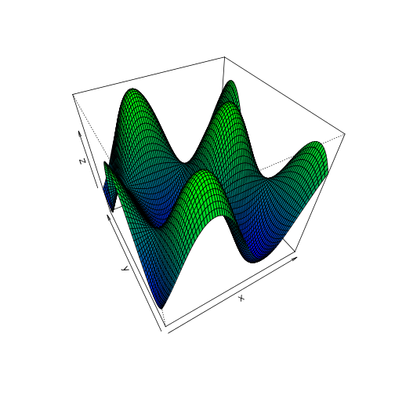

3D surface
========================================================

This is an R Markdown document. Markdown is a simple formatting syntax for authoring web pages (click the **Help** toolbar button for more details on using R Markdown).

When you click the **Knit HTML** button a web page will be generated that includes both content as well as the output of any embedded R code chunks within the document. You can embed an R code chunk like this:


```r
x <- seq(-4, 4, 0.1)
y <- seq(-4, 4, 0.1)
sc <- function(x, y) {
    sin(x) * cos(y)
}
z <- outer(x, y, sc)

color <- colorRampPalette(c("blue", "green"))(100)
zfacet <- z[-4, -4] + z[-4, -ncol(z)] + z[-nrow(z), -4] + z[-nrow(z), -ncol(z)]
facetcol <- cut(zfacet, 100)

persp(x, y, z, phi = 45, theta = -30, col = color[facetcol])
```

 

