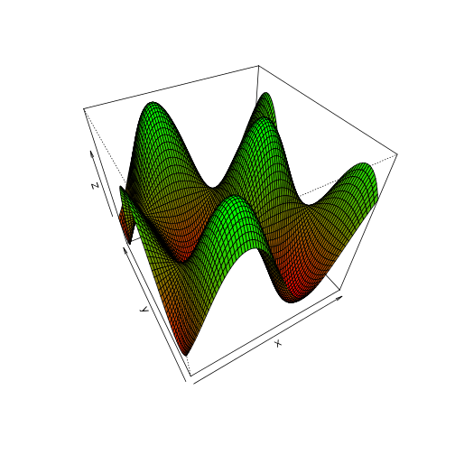

3D surface
========================================================

This is an R Markdown document. Markdown is a simple formatting syntax for authoring web pages (click the **Help** toolbar button for more details on using R Markdown).

When you click the **Knit HTML** button a web page will be generated that includes both content as well as the output of any embedded R code chunks within the document. You can embed an R code chunk like this:


```r
x <- seq(-4, 4, 0.1)
y <- seq(-4, 4, 0.1)
sc <- function(x, y) {
    sin(x) * cos(y)
}
z <- outer(x, y, sc)

gradualColor <- function(z, col1 = "blue", col2 = "green", n = 100) {
    color <- colorRampPalette(c(col1, col2))(n)
    zfacet <- z[-1, -1] + z[-1, -ncol(z)] + z[-nrow(z), -1] + z[-nrow(z), -ncol(z)]
    facetcol <- cut(zfacet, 100)
    return(color[facetcol])
}

persp(x, y, z, phi = 45, theta = -30, col = gradualColor(z, col1 = "red"))
```

 

