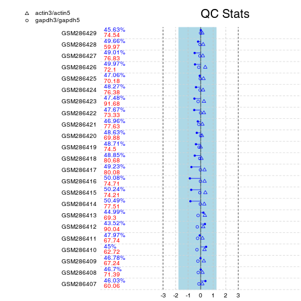
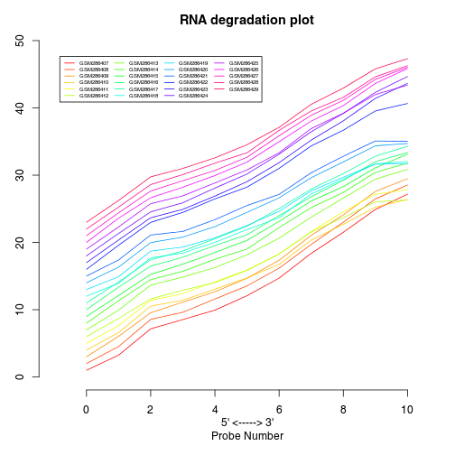
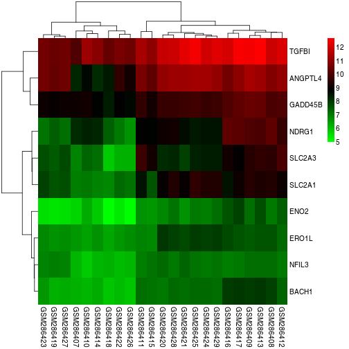

GSE11341
========================================================

##按照丰核要求做报告##

载入数据

```
## Loading required package: BiocGenerics
## Loading required package: parallel
## 
## Attaching package: 'BiocGenerics'
## 
## 下列对象被屏蔽了from 'package:parallel':
## 
##     clusterApply, clusterApplyLB, clusterCall, clusterEvalQ,
##     clusterExport, clusterMap, parApply, parCapply, parLapply,
##     parLapplyLB, parRapply, parSapply, parSapplyLB
## 
## 下列对象被屏蔽了from 'package:stats':
## 
##     xtabs
## 
## 下列对象被屏蔽了from 'package:base':
## 
##     anyDuplicated, append, as.data.frame, as.vector, cbind,
##     colnames, duplicated, eval, evalq, Filter, Find, get,
##     intersect, is.unsorted, lapply, Map, mapply, match, mget,
##     order, paste, pmax, pmax.int, pmin, pmin.int, Position, rank,
##     rbind, Reduce, rep.int, rownames, sapply, setdiff, sort,
##     table, tapply, union, unique, unlist
## 
## Loading required package: Biobase
## Welcome to Bioconductor
## 
##     Vignettes contain introductory material; view with
##     'browseVignettes()'. To cite Bioconductor, see
##     'citation("Biobase")', and for packages 'citation("pkgname")'.
## 
## Loading required package: AnnotationDbi
## Loading required package: org.Hs.eg.db
## Loading required package: DBI
```


质量检验


```
## Loading required package: genefilter
## Loading required package: gcrma
```

 

```
## Loading required package: preprocessCore
```

   


均一化


```
## Background correcting
## Normalizing
## Calculating Expression
```

 


选取差异表达基因


```
## 
## Attaching package: 'limma'
## 
## 下列对象被屏蔽了from 'package:BiocGenerics':
## 
##     plotMA
## 
## Loading required package: statmod
```


热图

 

