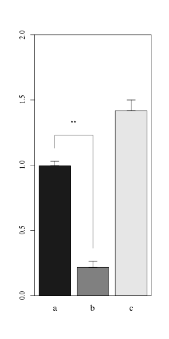

带连接线和星号的柱状图
========================================================
参考[StackOverflow]的例子，使用sciplot包绘制柱状图及误差线，手动添加连线和星号
[StackOverflow]:http://stackoverflow.com/questions/15535708/barplot-with-significant-differences-and-interactions

对于未分组的数据,将bargraph.CI绘制的图像对象保持到p，然后可以看到里面保存了坐标


```r
# 构建数据集
set.seed(1984)
category <- gl(3, 3, labels = c("a", "b", "c"))
value <- c(runif(3, min = 0.8, max = 1.2), rnorm(3, mean = 0.2, sd = 0.1), rnorm(3, 
    mean = 1.5, sd = 0.1))
data <- data.frame(category, value)

# 绘制柱状图
library(sciplot)
p <- bargraph.CI(category, value, data = data, col = gray(seq(0.1, 0.9, length = 3)), 
    ylim = c(0, 2), lc = F, family = "Times", cex.names = 1.25)
box()

# 根据每个图来微调+后参数，然后画连接线
y.cord <- c(p$CI[2, 1, 1] + 0.1, max(p$CI[2, 1, 1:2]) + 0.2, max(p$CI[2, 1, 
    1:2]) + 0.2, p$CI[2, 1, 2] + 0.1)  ##坐标意义为纵坐标CI[误差线最大值,分组中柱型，分组]
## 坐标意义横坐标xvals[分组中柱型,分组]
x.cord <- c(rep(p$xvals[1, 1], each = 2), rep(p$xvals[2, 1], each = 2))
lines(x.cord, y.cord)

# 画星星
x.text <- mean(p$xvals[1:2, 1])
y.text <- max(p$CI[2, 1, 1:2]) + 0.3
text("**", x = x.text, y = y.text)
```

 


对于分组的数据类似


```r
# 绘制柱状图
library(sciplot)
p <- bargraph.CI(dose,len,group=supp,data=ToothGrowth,xlab="Dose",ylab="Growth",
                 cex.lab=1.5,x.leg=1,col="black",angle=45,cex.names=1.25,
                 density=c(0,20),legend=T,lc=F,ylim=c(0,30),family="Times")
box()

# 根据每个图来微调+后参数，然后画连接线
y.cord <- matrix(nrow=0,ncol=4)
for (i in 1:2) ##1:2决定那些分组需要画线
  y.cord <-rbind(y.cord,c(p$CI[2,1,i]+1,max(p$CI[2,1:2,i])+2,max(p$CI[2,1:2,i])+2,
             p$CI[2,2,i]+1))

x.cord <- matrix(nrow=0,ncol=4)
for (i in 1:2)
  x.cord <- rbind(x.cord,c(rep(p$xvals[1,i],each=2),rep(p$xvals[2,i],each=2)))
for (i in 1:2)
  lines(x.cord[i,],y.cord[i,])

# 画星星
x.text <- colMeans(p$xvals[,1:2])
y.text <- apply(p$CI[2,1:2,],2,max)+3
text("**",x=x.text,y=y.text)
```

 

